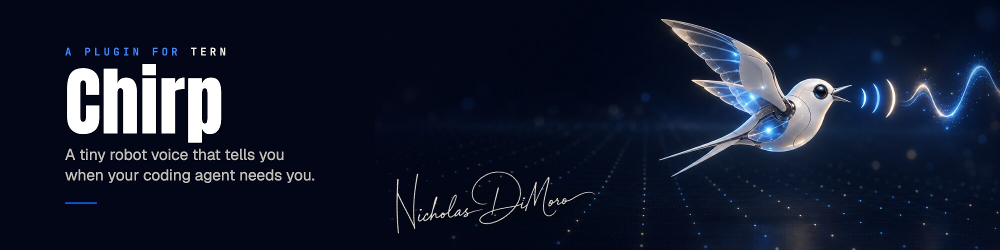
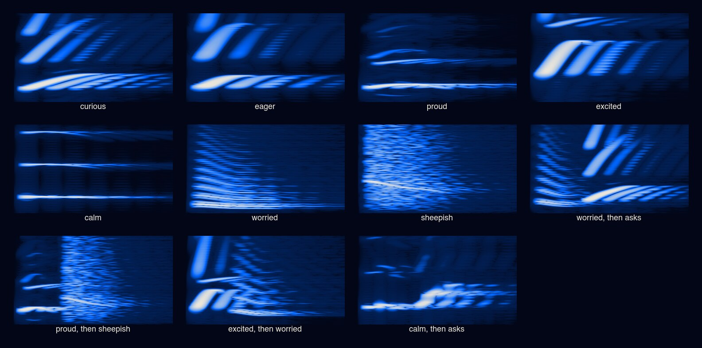

# Chirp

[](https://github.com/Noctivoro/tern-chirp/actions/workflows/test.yml)

Chirp gives [Tern](https://stencil.so/tern) a small robot voice. When an agent finishes its turn or stops to wait for you, Chirp makes one short, soft beep, and the beep's shape tells you how the turn went. A question rises, a win arcs up with a sparkle, and trouble droops. Mixed feelings get two syllables: what happened, then what the agent wants.

[Jev](https://typesafe.ai) decides how each turn feels. It reads the end of the agent's last message and answers six typed questions: mood, voice, pitch, pace, energy, and whether you are being asked something. It returns probabilities, not prose. Chirp turns those numbers into sound with a small synthesizer written in Luau, so the same message always sounds the same and two different messages rarely do.

The idea comes from Yohei Nakajima's [Beep Jev](https://beepjev.replit.app/), which gave Jev sound and colour parameters to choose from instead of words.



Listen to the samples in [`samples/`](samples). Each file is under two thirds of a second long.

Tested with Tern 0.6.1 on macOS. MIT licensed.

## Install

```sh
tern plugin install github.com/Noctivoro/tern-chirp
```

`tern plugin list` should show `chirp … ready`. Chirp runs in the window half of the plugin. If your window was open before you installed it, run the palette's **Reload plugins** once.

### Give Chirp a Jev key

Jev is in early access from [TypeSafe](https://typesafe.ai). On macOS, store your TypeSafe API key in the Keychain. The command prompts for the key, so it never lands in your shell history:

```sh
security add-generic-password -s typesafe-api-key -a default -w
```

Chirp also reads `TYPESAFE_API_KEY` from Tern's environment, which is the way to set it on Linux.

Without a key, Chirp still speaks, using a local reading instead of Jev. It sounds curious when the agent is waiting for you or its message ends in `?`, and calm otherwise.

## What you hear

| Jev's answer | What it changes |
| --- | --- |
| Mood: curious, eager, proud, excited, calm, worried or sheepish | The pitch shape. Curious rises, eager lifts quickly, proud arcs, excited leaps an octave, calm settles, worried droops, and sheepish goes up and then slides away. A second mood at 25% or more adds a second syllable. |
| Voice: chirp, blip, bubble, robot, chatter or whisper | The timbre: an FM tweet, a filtered square beep, a sine bloop, a ring-modulated buzz, a warbling triangle, or breathy noise. A runner-up voice above 20% sings the second syllable. |
| Pitch, 0–4 | The base note, from about 220 to 800 Hz |
| Pace, 0–4 | How long the syllable lasts |
| Energy, 0–4 | Loudness, vibrato speed and how much echo |
| Asks you something | The last syllable ends high. A mood that doesn't ask (worried, say) gets a rising question syllable after it. |

Jev's confidence in the mood controls the vibrato, so an unsure reading makes the voice wobble. The words of the message's key sentence (its last question, or else its first sentence) nudge the pitch and tone.

Chirp is meant to nudge you, not startle you. Each sound peaks at half of full scale, fades in over at least 12 ms, passes through a 2.5 kHz low-pass filter, and plays at 20% volume by default.

## When it speaks

- When an agent goes from working to idle (turn done), or to waiting for input.
- Not for turns under 12 seconds in the pane you have focused, because you were watching.
- Once per turn, even with several Tern windows open.

Tern has no event for agent state changes, so Chirp reads the agent list from Tern's memory every 700 ms. It plays sound with `afplay` on macOS and `paplay` on Linux.

## Commands

All of these are in the palette.

| Command | What it does |
| --- | --- |
| **Chirp: Mute or unmute the voice** | Turns Chirp off and on |
| **Chirp: Say the focused agent's last turn** | Sends the focused agent's last message through Jev and plays it, or a sample sentence when no agent has focus |
| **Chirp: Replay the last chirp** | Plays the last sound again |
| **Chirp: What did that chirp mean?** | Shows Jev's reading: mood, voice, pitch, pace, energy, confidence and source |
| **Chirp: Louder** / **Chirp: Softer** | Changes the volume in 15% steps and plays the last sound at the new level |

## Privacy

Each spoken turn sends up to about 900 characters of the agent's last message (its start and its end) to TypeSafe's API. Chirp holds your key in memory only. It never writes the key to a log, the plugin's data file or the screen. If you would rather not send agent messages anywhere, leave the key unset and Chirp uses the local reading.

## Develop

```sh
brew install luau      # standalone Luau runtime for the checks
npm test               # type-checks lib/ and runs test/run.luau
npm run audition       # renders every preset and plays it at the default volume
```

`node bin/audition.mjs --out DIR` writes the presets to `DIR` without playing them. The files in `samples/` come from this command.

| Path | What |
| --- | --- |
| `window.luau` | Watches agents, calls Jev, plays sound, registers the palette commands |
| `lib/director.luau` | Builds the Jev request and parses its answer, or makes the local reading |
| `lib/voice.luau` | Turns a reading and a message into one or two syllables |
| `lib/synth.luau` | Renders notes to a 16-bit WAV: oscillators, glides, filters, echo |
| `test/run.luau` | Checks for parsing, phrase picking, composition and rendering |
| `test/presets.luau`, `bin/audition.mjs` | The audition presets and their renderer |

After you change `window.luau`, run the palette's **Reload plugins**.

## Also by me

[Margin](https://github.com/Noctivoro/tern-margin) lets you review Markdown files in Tern and leave comments that agents can read.

---

Made by [Nicholas DiMoro](https://nickdimoro.com).
